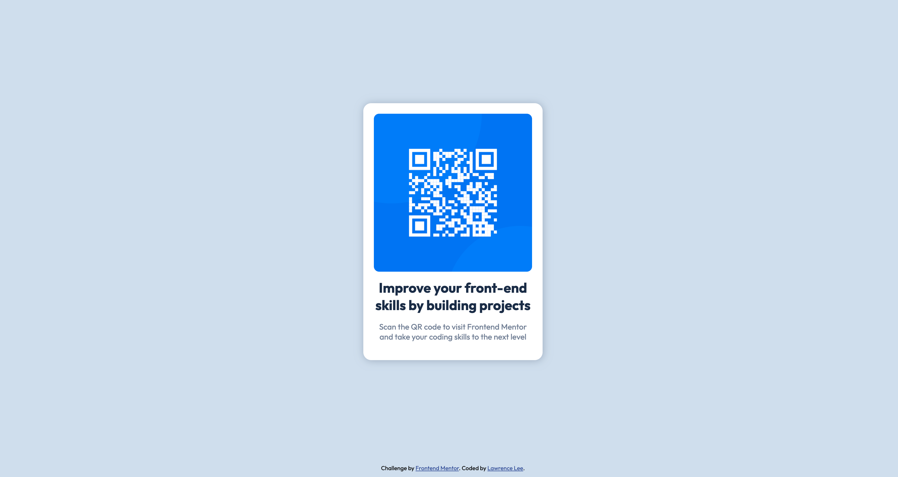

# Frontend Mentor - QR code component solution

This is a solution to the [QR code component challenge on Frontend Mentor](https://www.frontendmentor.io/challenges/qr-code-component-iux_sIO_H). Frontend Mentor challenges help you improve your coding skills by building realistic projects.

## Table of contents

- [Overview](#overview)
  - [Screenshot](#screenshot)
  - [Links](#links)
- [My process](#my-process)
  - [Built with](#built-with)
  - [What I learned](#what-i-learned)
  - [Continued development](#continued-development)
  - [Useful resources](#useful-resources)
- [Author](#author)

## Overview

### Screenshot

Desktop

Mobile

### Links

- Solution URL: [Add solution URL here](https://your-solution-url.com)
- Live Site URL: [Add live site URL here](https://your-live-site-url.com)

## My process

### Built with

- Semantic HTML5 markup
- CSS3 with variables for colours
- Flexbox
- Media query for mobile viewports up to 375px
- Hover state when mouse pointer is over the container
- Media query with prefers reduce motion to remove animations if the user has enabled it in their operation system's settings.
- QR Code is also a clickable link if user prefers to click or tap.

### What I learned

This was a relatively straightforward HTML and CSS component. The major challenges were finding a feasible solution to preventing the QR code image from expanding outside its parent container. Using a width of 100% on the img class. Finally, it was important that I constrain the size of the entire qr component so that it was not oversized for desktop and tablet viewports.

While most of the css selectors for animations or effects should be within the :hover CSS psuedo-class, the transition should be added as styling to the original selector .qr-container.

### Continued development

"Clickable" qr code is now working and was implemented Monday June 10th. The link is also selectable using keyboard navigation. Open to feedback for additional features and styling enhancements.

### Useful resources

- [Fitting a CSS Image Into A Container](https://www.shecodes.io/athena/72487-how-to-get-a-css-image-to-fit-in-a-container-like-fit-to-size#:~:text=To%20get%20a%20CSS%20image%20to%20fit%20into%20a%20container,if%20the%20container%20size%20changes.) - The suggestions on this webpage provided me with ideas on how to progress. It was useful in overcoming the roadblock of constraining the image to fit in its container at all viewports. I have added this resource to my personal knowledge management for future reference.

## Author

- Website - [Lawrence Lee](https://www.lawrencelcodes.dev/)
- Frontend Mentor - [@LawrenceLCodes](https://www.frontendmentor.io/profile/LawrenceLCodes)
- GitHub - [LawrenceLCodes](https://github.com/LawrenceLCodes)
